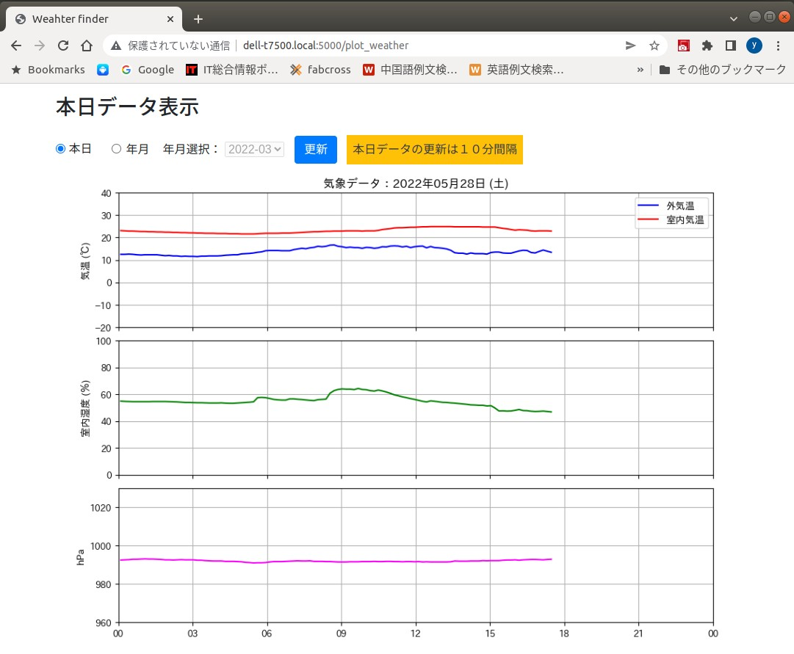
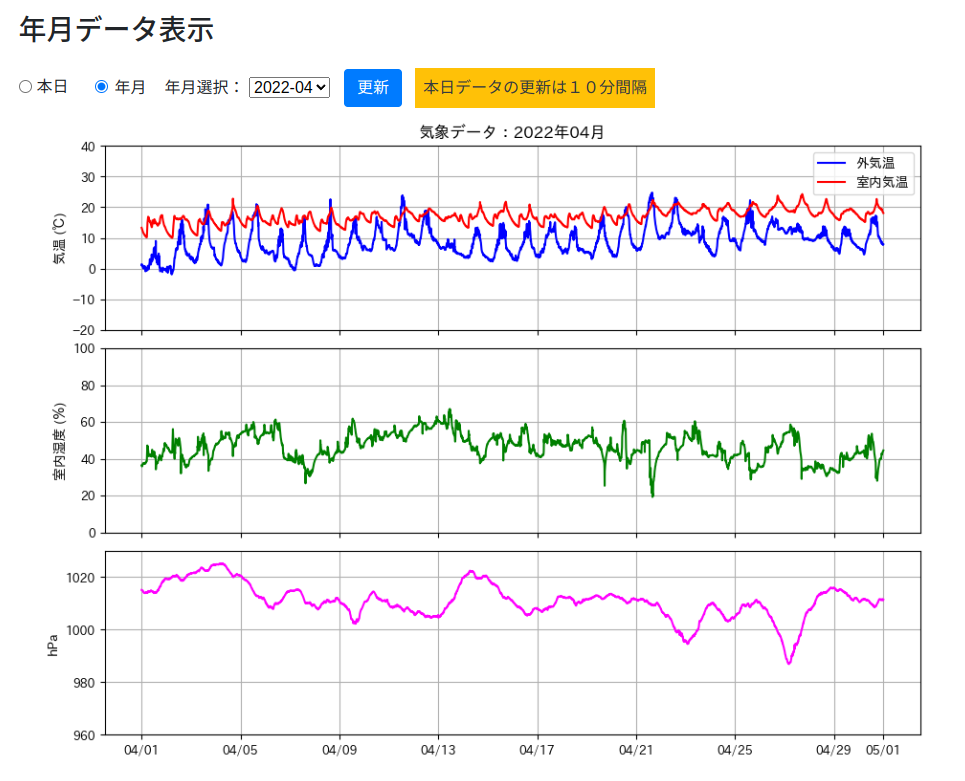
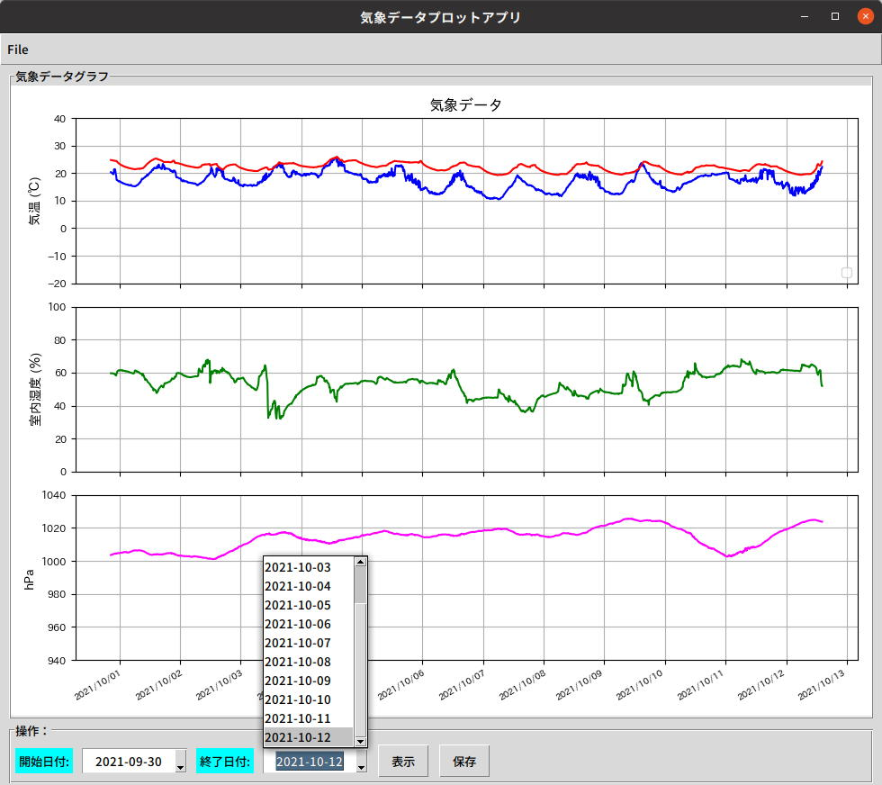
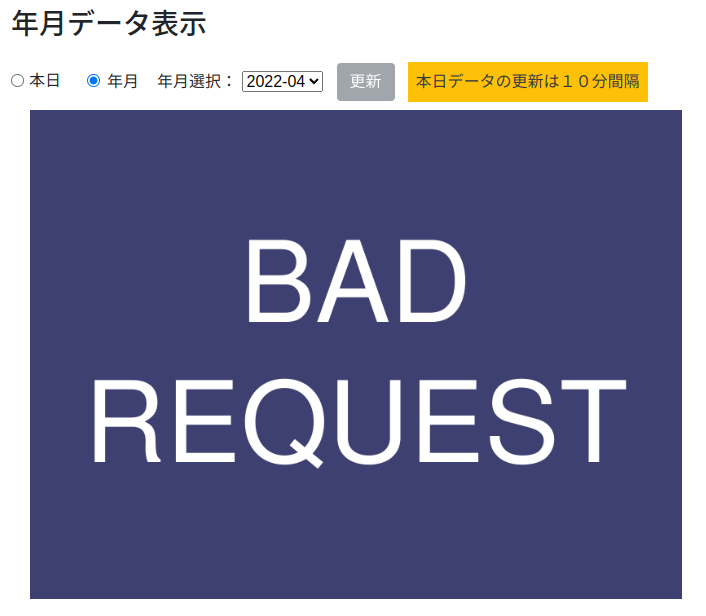

# 気象データ表示Webアプリケーション

Matplotlibで生成したグラフをファイル保存せずに直接ブラウザに表示する方法について解説します。  

画面は１画面で、初期画面(本日データ画像含む)はFlask側で生成。それ以降の画像データの読み込みはJavaScrpitで実行します。

## 1. Webアプリケーションの構成

* Flask 2 (Python) + Bootstrap 4 + Vue.js 2 (http通信: axios)
* Pythonグラフ描画ライブラリ Matplotlib 3.5
* Pythonのデータ解析ライブラリ Pandas 1.3
* データベース SQLite3 ※非力なラズパイゼロで観測データを貯めているため軽量なデータベースを使用

### 1-1. 当日データ表示画面

* ESPセンサーモジュールが観測データを10分間隔にUDPパケットでプライベートネットワークにブロードキャスト送信しています。
* そのUDPパケットをラズパイと自宅公開サーバーの両方で受信しデータベースに記録しています。
* この画面では当日の気象データをデータベースから取得し、0時〜翌0時までの期間で表示します。
* 2回目以降はJavaScriptがサーバサイド側に本日データの最新をリクエストします。
 
<div style="text-align:center;border:solid;">

</div>
<br/>


### 1-2. 年月データ表示

* 初期画面表示時にデータベースから年月選択リスト(降順)を取得しています。
* ラジオボタン[年月]を押下するとタイトルが「年月データ表示」にかわり年月セレクトボックスが有効になります。
* 表示したい年月を選択し更新ボタンを押下すると、JavaScriptがセレクトボックスで選択した年月の画像をサーバサイド側にリクエストします。
* サーバサイド側は要求された年月のデータをデータベースから取得しMatplotlibライブラリを使ってグラフを生成しbase64エンコードした文字列としてJsonでクライアント側に返却します。
* JavaScriptでは受信したbase64エンコード文字列済みの画像をイメージタグのソースに設定し新たな画像を表示します。

<div style="text-align:center;border:solid;">

</div>
<br/>

#### このWebアプリの元になったのは [home_weather_sensors]リポジトリの learn_matplotlibプロジェクトで、下記がGUIウインドウに画像を出力したときの画面となります。

※こちらのアプリでは観測データのCSVファイルからMatplotlibのグラフを生成し、任意の期間を選択して表示・保存することがてきます。
<div style="text-align:center;border:">

</div>
<br/>

### 1-3. 不正リクエスト時の表示

* Google Chromeデベロッパーツールで不正な日付を送信するところ。  
  (例) "2022-03" ==> "202213"

<div style="text-align:center;border:solid;">

</div>
<br/>

* BAD REQUEST の画像を表示して、更新ボタンを不可に設定。

<div style="text-align:center;border:solid;">

</div>
<br/>

## 2.参考にしたソースの出典元の紹介

### 2-1. デーベースからPandas データフレームを生成する方法

(参考URL) **Pandas 本家サイト**:  pandas.read_sql  
<https://pandas.pydata.org/docs/reference/api/pandas.read_sql.html>

(1) データ登録のサンプル ※デーベースはSQLite3

```python
from sqlite3 import connect
conn = connect(':memory:')
df = pd.DataFrame(data=[[0, '10/11/12'], [1, '12/11/10']],
                  columns=['int_column', 'date_column'])
df.to_sql('test_data', conn)
```

(2) データベース接続(coon)とSQLからデータフレームを生成するサンプル

```python
pd.read_sql('SELECT int_column, date_column FROM test_data',
            conn,
            parse_dates=["date_column"])
   int_column date_column
0           0  2012-10-11
1           1  2010-12-11
```

* 上記(2)のサンプルからでは分かりませんが、**プレースフォルダ付SQLとそれに対応するパラメータを渡すことができます。**  
(参考URL) **本家Github** pandas-dev/pandas  
<https://github.com/pandas-dev/pandas/blob/v1.3.2/pandas/io/sql.py>

* 対応するプレースフォルダについては下記のサイトをご覧ください。  
(参考URL) **PEP 249** – Python Database API Specification v2.0  
<https://peps.python.org/pep-0249/>

pandas.read_sql() 呼び出し箇所のPyDoc

```python
def read_sql(
    sql,
    con,
    index_col: str | Sequence[str] | None = None,
    coerce_float: bool = True,
    params=None,
    parse_dates=None,
    columns=None,
    chunksize: int | None = None,
) -> DataFrame | Iterator[DataFrame]:
    """
    Read SQL query or database table into a DataFrame.
    This function is a convenience wrapper around ``read_sql_table`` and
    ``read_sql_query`` (for backward compatibility). It will delegate
    to the specific function depending on the provided input. A SQL query
    will be routed to ``read_sql_query``, while a database table name will
    be routed to ``read_sql_table``. Note that the delegated function might
    have more specific notes about their functionality not listed here.
    Parameters
    ----------
    sql : str or SQLAlchemy Selectable (select or text object)
        SQL query to be executed or a table name.
    con : SQLAlchemy connectable, str, or sqlite3 connection
        Using SQLAlchemy makes it possible to use any DB supported by that
        library. If a DBAPI2 object, only sqlite3 is supported. The user is responsible
        for engine disposal and connection closure for the SQLAlchemy connectable; str
        connections are closed automatically. See
        `here <https://docs.sqlalchemy.org/en/13/core/connections.html>`_.
    index_col : str or list of str, optional, default: None
        Column(s) to set as index(MultiIndex).
    coerce_float : bool, default True
        Attempts to convert values of non-string, non-numeric objects (like
        decimal.Decimal) to floating point, useful for SQL result sets.
    params : list, tuple or dict, optional, default: None
        List of parameters to pass to execute method.  The syntax used
        to pass parameters is database driver dependent. Check your
        database driver documentation for which of the five syntax styles,
        described in PEP 249's paramstyle, is supported.
        Eg. for psycopg2, uses %(name)s so use params={'name' : 'value'}.

    ...一部省略...    
    Returns

```

* PEP 249形式のパラメータに対応するデータベースはSQLite3のみ、それ以外データベースは SQLAlchemy 経由となっています  

```python
def execute(sql, con, params=None):
    """
    Execute the given SQL query using the provided connection object.
    Parameters
    ----------
    sql : string
        SQL query to be executed.
    con : SQLAlchemy connectable(engine/connection) or sqlite3 connection
        Using SQLAlchemy makes it possible to use any DB supported by the
        library.
        If a DBAPI2 object, only sqlite3 is supported.
    params : list or tuple, optional, default: None
        List of parameters to pass to execute method.
    Returns
    -------
    Results Iterable
    """
    pandas_sql = pandasSQL_builder(con)
    args = _convert_params(sql, params)
    return pandas_sql.execute(*args)
```


### 2-2. グラフ描画イメージからHTMLイメーシタグを生成する方法

(URL) **Matplotlib 本家サイト:**  Embedding in a web application server (Flask)
<https://matplotlib.org/3.5.0/gallery/user_interfaces/web_application_server_sgskip.html>

一般的には下記のように **plt** というショートカットを通じてグラフ(figure)を生成しますが、画面を表示せずに画像を生成する場合はショートカット **plt** は使わないことになります。

```
import numpy as np
import matplotlib.pyplot as plt

x = np.linspace(-4.5, 4.5, 100, endpoint=True)
y = f(x)
dy = df_dx(x)

fig = plt.figure()
plt.xlabel('x')
# ゼロの縦軸と横軸のライン
plt.axhline(0, color="black", linestyle="solid", linewidth=0.5)
... 一部省略 ...
plt.show()              # グラフ画面に表示
```

こちらは本家サイトのサンプルコードですが、**plt** というショートカットは使われていません。  
一番の肝は、グラフ画像をバイトストリームを通してHTMLのイメージタグを生成する処理です。   
※(1)から(4)までのコード部分

```python
import base64
from io import BytesIO

from flask import Flask
from matplotlib.figure import Figure

app = Flask(__name__)

@app.route("/")
def hello():
    # Generate the figure **without using pyplot**.
    fig = Figure() 
    ax = fig.subplots()
    ax.plot([1, 2])
    # Save it to a temporary buffer.
    buf = BytesIO()                                           (1)
    fig.savefig(buf, format="png")                            (2)
    # Embed the result in the html output.
    data = base64.b64encode(buf.getbuffer()).decode("ascii")  (3)
    return f""       (4)
```


## 3. 当Webアプリのソースの説明

### 3-1. DAOクラス

データベースパスは環境変数から取得するようにしています。

[環境変数 (.bashrc) ] データベースパス  
(開発環境) /home/yukio/db/weather.db
```bash
export PATH_RASPI_BASE=$HOME
export PATH_WEATHER_DB=$PATH_RASPI_BASE/db/weather.db 
```

SQLはSQLite3に特有の関数を使ったものになります。  

[dao/weatherdao.py] ※ログ出力部分は省略
```python
from ..db.sqlite3conv import strdate2timestamp
from ..util.dateutil import nextYearMonth

""" 気象データDAOクラス """

HEADER_WEATHER = '"did","measurement_time","temp_out","temp_in","humid","pressure"'
HEADER_DEVICE = '"id","name"'

my_home = os.environ.get("HOME", "/home/yukio")
weather_db = os.environ.get("PATH_WEATHER_DB", my_home + "/db/weather.db")

class WeatherDao:
... 一部省略 ...
    _QUERY_GROUPBY_MONTHS = """
SELECT
  strftime('%Y-%m', measurement_time, 'unixepoch', 'localtime') 
FROM
  t_weather
WHERE
  did=(SELECT id FROM t_device WHERE name=?)
  AND
  strftime('%Y-%m', measurement_time, 'unixepoch', 'localtime') >= ?
  GROUP BY strftime('%Y-%m', measurement_time, 'unixepoch', 'localtime')
  ORDER BY strftime('%Y-%m', measurement_time, 'unixepoch', 'localtime') DESC;
"""

    def __init__(self, conn, logger=None):
        self.conn = conn
        self.logger = logger

... 一部省略 ...

    def _getDateGroupByList(self, qrouping_sql, device_name, start_date):
        """観測デバイスのグルーピングSQLに対応した日付リストを取得する

        Args:
            qrouping_sql str: グルーピングSQL
            device_name str: 観測デバイス名
            start_date str: 検索開始日付

        Returns:
          list: 文字列の日付 (年月 | 年月日)
        """
        # Check start_date
        strdate2timestamp(start_date)
        cursor = self.conn.cursor()
        try:
            cursor.execute(
                qrouping_sql,
                (
                    device_name,
                    start_date,
                ),
            )
            # fetchall() return tuple list [(?,), (?,), ..., (?,)]
            tupledlist = cursor.fetchall()
            # tuple -> list
            result = [item for (item,) in tupledlist]
        finally:
            cursor.close()
        return result

... 一部省略 ...

    def getGroupbyMonths(self, device_name, start_date):
        """観測デバイスの年月にグルーピングしたリストを取得する

        Args:
            device_name str: 観測デバイス名
            start_date str: 検索開始年月日

        Returns:
            list[str]: 降順の年月リスト(%Y-%m)
        """
        return self._getDateGroupByList(
            self._QUERY_GROUPBY_MONTHS, device_name, start_date
        )
```

### 3-2. Pandas データフレーム生成クラス

SQLの違いはプレースフォルダだけになります。DAOクラスはプレースフォルダが [?]スタイル、Pandasの方は [Named style]としています。

* 当日データのデータフレーム生成メソッド: getTodayDataFrame()
* 指定された年月ののデータフレーム生成メソッド: getMonthDataFrame()

データフレームの生成方法は本家サンプル 2-1.(2) と同じです
```python
pd.read_sql(sql, self.conn, parse_dates=["measurement_time"])
```

[dao/weatherdbwithpandas.py] ※ログ出力部分は省略
```python
class WeatherPandas:
    """Not use did coloumn"""

    _QUERY_TODAY_DATA = """
    SELECT
       datetime(measurement_time, 'unixepoch', 'localtime') as measurement_time
       , temp_out, temp_in, humid, pressure
    FROM
       t_weather
    WHERE
       did=(SELECT id FROM t_device WHERE name=:device_name)
       AND
       measurement_time >= strftime('%s', date(:today), '-9 hours')
    ORDER BY did, measurement_time;
    """

    _QUERY_MONTH_DATA = """
    SELECT
       datetime(measurement_time, 'unixepoch', 'localtime') as measurement_time
       , temp_out, temp_in, humid, pressure
    FROM
       t_weather
    WHERE
       did=(SELECT id FROM t_device WHERE name=:device_name)
       AND (
         measurement_time >= strftime('%s', date(:day_start), '-9 hours')
         AND
         measurement_time < strftime('%s', date(:day_end), '-9 hours')
       )
    ORDER BY did, measurement_time;
    """

    def __init__(self, conn, logger=None):
        self.conn = conn
        self.logger = logger

    def getTodayDataFrame(self, device_name, today="now"):
        query_params = {"device_name": device_name, "today": today}

        return pd.read_sql(
            self._QUERY_TODAY_DATA,
            self.conn,
            params=query_params,
            parse_dates=["measurement_time"],
        )

    def getMonthDataFrame(self, device_name, s_year_month):
        s_start = s_year_month + "-01"
        s_end_exclude = nextYearMonth(s_start)
        query_params = {
            "device_name": device_name,
            "day_start": s_start,
            "day_end": s_end_exclude,
        }

        return pd.read_sql(
            self._QUERY_MONTH_DATA,
            self.conn,
            params=query_params,
            parse_dates=["measurement_time"],
        )
```

### 3-3. Matplotlibグラフ出力関数

グラフ出力についてはクラスではなく関数として実装しています。

変数 PLOT_CONFは設定ファイル [dao/conf/plot_weather.json] を読み込みしたもので内容は下記の通り。
```json
{
  "font.family": "IPAexGothic",
  "label.sizes": [10, 9, 9],
  "figsize": {
    "phone": [6, 10],
    "tablet": [8, 7],
    "pc": [11, 8]
  },
  "ylim": {
    "temp": [-20, 40],
    "pressure": [960, 1030]
  }
}
```

変数 WEATHER_CONFは設定ファイル [dao/conf/weather.json] を読み込みしたもので内容は下記の通り。

```json
{
  "DEVICE_NAME":"esp8266_1",  <= ESPセンサーモジュール名 
  "STA_YEARMONTH": "2021-11",  <== 観測データが安定した年月、これ以前のデータは欠損が多いため除外
  "TODAY": "now" <== テスト用に変更可能 (例) 本日["now"] 又は、過去日の ["2022-01-30"] もOK
}
```

HTMLイメージ用ソースの生成部分を一部抜粋  
下記 [**img_src**] が HTML出力側の[**imgSrc**]に設定され画像としてブラウザに表示されます。

```python
    fig = Figure(figsize=PLOT_CONF["figsize"]["pc"])
    (ax_temp, ax_humid, ax_pressure) = fig.subplots(3, 1, sharex=True)

    buf = BytesIO()
    fig.savefig(buf, format="png", bbox_inches="tight")
    data = base64.b64encode(buf.getbuffer()).decode("ascii")
    img_src = "data:image/png;base64," + data
    return img_src 
```

HTML出力側のイメージタグ部分を抜粋

[templates/showplotweather.html]
```html
<div class="col-auto my-1 mx-1">
     
</div>
```

[plotter/plotterweather.py] ※ログ出力部分とコメントを一部省略しています

引数 year_month が未設定の場合は当日データ、設定されている場合は年月データとしてタイトルと時間軸の見出しを切り替えしています。

```python
import base64
from io import BytesIO

from matplotlib import rcParams
from matplotlib.dates import DateFormatter
from matplotlib.figure import Figure
from matplotlib.pyplot import setp

from ..dao.weathercommon import PLOT_CONF, WEATHER_CONF
from ..dao.weatherdbwithpandas import PLOT_WEATHER_IDX_COLUMN, WeatherPandas
from ..util.dateutil import (
    addDayString,
    datetimeToJpDateWithWeek,
    strDateToDatetimeTime000000,
)

# 日本語フォント設定
rcParams["font.family"] = PLOT_CONF["font.family"]

def gen_plotimage(conn, year_month=None, logger=None):
    wpd = WeatherPandas(conn, logger=logger)
    if year_month is None:
        # 本日データ
        df = wpd.getTodayDataFrame(
            WEATHER_CONF["DEVICE_NAME"], today=WEATHER_CONF["TODAY"]
        )
        # タイムスタンプをデータフレームのインデックスに設定
        df.index = df[PLOT_WEATHER_IDX_COLUMN]
        # 先頭の測定日付(Pandas Timestamp) から Pythonのdatetimeに変換
        # https://pandas.pydata.org/pandas-docs/version/0.22/generated/pandas.Timestamp.to_datetime.html
        first_datetime = df.index[0].to_pydatetime()
        # 当日の日付文字列 ※一旦 date()オブジェクトに変換して"年月日"を取得
        s_first_date = first_datetime.date().isoformat()
        # 表示範囲：当日の "00:00:00" から
        x_day_min = strDateToDatetimeTime000000(s_first_date)
        # 翌日の "00:00:00" 迄
        s_nextday = addDayString(s_first_date)
        x_day_max = strDateToDatetimeTime000000(s_nextday)
        # タイトル用の日本語日付(曜日)
        s_title_date = datetimeToJpDateWithWeek(first_datetime)
    else:
        # 指定された年月データ
        df = wpd.getMonthDataFrame(WEATHER_CONF["DEVICE_NAME"], year_month)
        # タイムスタンプをデータフレームのインデックスに設定
        df.index = df[PLOT_WEATHER_IDX_COLUMN]
        # タイトル用の日本語日付(曜日)
        splited = year_month.split("-")
        s_title_date = f"{splited[0]}年{splited[1]}月"
    # データフレームをDEBUGレベルでログに出力
    if logger is not None:
        logger.debug(df)

    fig = Figure(figsize=PLOT_CONF["figsize"]["pc"])
    label_fontsize, ticklabel_fontsize, ticklable_date_fontsize = tuple(
        PLOT_CONF["label.sizes"]
    )
    grid_styles = {"linestyle": "- -", "linewidth": 1.0}
    # PC用
    (ax_temp, ax_humid, ax_pressure) = fig.subplots(3, 1, sharex=True)

    # サブプロット間の間隔を変更する
    fig.subplots_adjust(wspace=0.1, hspace=0.1)
    # 軸ラベルなどのフォントサイズを設定
    for ax in [ax_temp, ax_humid, ax_pressure]:
        setp(ax.get_xticklabels(), fontsize=ticklable_date_fontsize)
        setp(ax.get_yticklabels(), fontsize=ticklabel_fontsize)

    if year_month is None:
        # 1日データx軸の範囲: 当日 00時 から 翌日 00時
        for ax in [ax_temp, ax_humid, ax_pressure]:
            ax.set_xlim([x_day_min, x_day_max])

    # temp_out and temp_in
    ax_temp.plot(
        df[PLOT_WEATHER_IDX_COLUMN],
        df["temp_out"],
        color="blue",
        marker="",
        label="外気温",
    )
    ax_temp.plot(
        df[PLOT_WEATHER_IDX_COLUMN], df["temp_in"], color="red", marker="", label="室内気温"
    )
    ax_temp.set_ylim(PLOT_CONF["ylim"]["temp"])
    ax_temp.set_ylabel("気温 (℃)", fontsize=label_fontsize)
    ax_temp.legend(loc="upper right")
    ax_temp.set_title("気象データ：{}".format(s_title_date))
    # Hide xlabel
    ax_temp.label_outer()
    ax_temp.grid(grid_styles)

    # humid
    ax_humid.plot(df[PLOT_WEATHER_IDX_COLUMN], df["humid"], color="green", marker="")
    ax_humid.set_ylim([0, 100])
    ax_humid.set_ylabel("室内湿度 (％)", fontsize=label_fontsize)
    # Hide xlabel
    ax_humid.label_outer()
    ax_humid.grid(grid_styles)

    # pressure
    if year_month is None:
        # 当日データなので軸ラベルは時間 (00,03,06,09,12,15,18,21,翌日の00)
        ax_pressure.xaxis.set_major_formatter(DateFormatter("%H"))
    else:
        # 指定年月していなので軸は"月/日"
        ax_pressure.xaxis.set_major_formatter(DateFormatter("%m/%d"))

    ax_pressure.plot(
        df[PLOT_WEATHER_IDX_COLUMN], df["pressure"], color="fuchsia", marker=""
    )
    ax_pressure.set_ylim(PLOT_CONF["ylim"]["pressure"])
    ax_pressure.set_ylabel("hPa", fontsize=label_fontsize)
    ax_pressure.grid(grid_styles)

    # 画像をバイトストリームに溜め込みそれをbase64エンコードしてレスポンスとして返す
    buf = BytesIO()
    fig.savefig(buf, format="png", bbox_inches="tight")
    data = base64.b64encode(buf.getbuffer()).decode("ascii")
    img_src = "data:image/png;base64," + data
    return img_src
```

### 3-4. リクエスト処理

* (1) 当日データを表示する初期画面
* (2) JavaScriptからの当日データ取得リクエストをうけ、当日データから画像を生成してjsonで返却します
* (3) JavaScriptからの年月データ取得リクエストをうけ、指定された年月の月間データから画像を生成してjsonで返却します

[views/app_main.py]
```python
from flask import abort, g, jsonify, render_template
from plot_weather import (
    BAD_REQUEST_IMAGE_DATA,
    INTERNAL_SERVER_ERROR_IMAGE_DATA,
    app,
    app_logger,
)
from plot_weather.dao.weathercommon import WEATHER_CONF
from plot_weather.dao.weatherdao import WeatherDao, weather_db
from plot_weather.db import sqlite3db
from plot_weather.db.sqlite3conv import DateFormatError, strdate2timestamp
from plot_weather.plotter.plotterweather import gen_plotimage
from werkzeug.exceptions import BadRequest

APP_ROOT = app.config["APPLICATION_ROOT"]
CODE_BAD_REQUEST, CODE_INTERNAL_SERVER_ERROR = 400, 500
MSG_TITLE_SUFFIX = app.config["TITLE_SUFFIX"]
MSG_STR_TODAY = app.config["STR_TODAY"]


def get_dbconn():
    db = getattr(g, "_dbconn", None)
    if db is None:
        db = g._dbconn = sqlite3db.get_connection(
            weather_db, read_only=True, logger=app_logger
        )
    return db


@app.errorhandler(BadRequest)
def incorrect_access(ex):
    return "Bad request !", CODE_BAD_REQUEST


@app.teardown_appcontext
def close_conn(exception):
    db = getattr(g, "_dbconn", None)
    app_logger.debug(f"db:{db}")
    if db is not None:
        db.close()


@app.route(APP_ROOT, methods=["GET"])                          # (1)
def index():
    """本日データ表示画面 (初回リクエストのみ)

    :return: 本日データ表示HTMLページ (matplotlibでプロットした画像含む)
    """
    try:
        conn = get_dbconn()
        # 年月日リスト取得
        dao = WeatherDao(conn, logger=app_logger)
        yearMonthList = dao.getGroupbyMonths(
            device_name=WEATHER_CONF["DEVICE_NAME"],
            start_date=WEATHER_CONF["STA_YEARMONTH"],
        )
        app_logger.debug("yearMonthList:{}".format(yearMonthList))
        # 本日データプロット画像取得
        imgBase64Encoded = gen_plotimage(conn, logger=app_logger)
    except Exception as exp:
        app_logger.error(exp)
        return abort(CODE_INTERNAL_SERVER_ERROR)

    strToday = app.config.get("STR_TODAY")
    titleSuffix = app.config.get("TITLE_SUFFIX")
    defaultMainTitle = strToday + titleSuffix
    return render_template(
        "showplotweather.html",
        ip_host=app.config["SERVER_NAME"],
        app_root_url=APP_ROOT,
        path_get_today="/gettoday",
        path_get_month="/getmonth/",
        str_today=strToday,
        title_suffix=titleSuffix,
        info_today_update_interval=app.config.get("INFO_TODAY_UPDATE_INTERVAL"),
        default_main_title=defaultMainTitle,
        year_month_list=yearMonthList,
        img_src=imgBase64Encoded,
    )


@app.route("/plot_weather/gettoday", methods=["GET"])         # (2)
def getTodayImage():
    """本日データ取得リクエスト(2回以降) JavaScriptからのリクエスト想定

    :return: jSON形式(matplotlibでプロットした画像データ(形式: png)のbase64エンコード済み文字列)
         (出力内容) jSON('data:image/png;base64,... base64encoded data ...')
    """
    app_logger.debug("getTodayImage()")
    try:
        conn = get_dbconn()
        # 本日データプロット画像取得
        imgBase64Encoded = gen_plotimage(conn, year_month=None, logger=app_logger)
    except Exception as exp:
        app_logger.error(exp)
        return _create_error_response(CODE_INTERNAL_SERVER_ERROR)

    return _create_image_response(imgBase64Encoded)


@app.route("/plot_weather/getmonth/<yearmonth>", methods=["GET"]) # (3)
def getMonthImage(yearmonth):
    """要求された年月の月間データ取得

    :param yearmonth str: 年月 (例) 2022-01
    :return: jSON形式(matplotlibでプロットした画像データ(形式: png)のbase64エンコード済み文字列)
         (出力内容) jSON('data:image/png;base64,... base64encoded data ...')
    """
    app_logger.debug("yearmonth: {}".format(yearmonth))
    try:
        # リクエストパラメータの妥当性チェック: "YYYY-mm" + "-01"
        chk_yyyymmdd = yearmonth + "-01"
        # 日付チェック(YYYY-mm-dd): 日付不正の場合例外スロー
        strdate2timestamp(chk_yyyymmdd, raise_error=True)
        conn = get_dbconn()
        # 指定年月(year_month)データプロット画像取得
        imgBase64Encoded = gen_plotimage(conn, year_month=yearmonth, logger=app_logger)
    except DateFormatError as dfe:
        # BAD Request
        app_logger.warning(dfe)
        return _create_error_response(CODE_BAD_REQUEST)
    except Exception as exp:
        # ここにくるのはDBエラー・バグなど想定
        app_logger.error(exp)
        return _create_error_response(CODE_INTERNAL_SERVER_ERROR)

    return _create_image_response(imgBase64Encoded)


@app.route("/plot_weather/getcurrenttimedata", methods=["GET"])
def getcurrenttimedata():
    """現在時刻での最新の気象データを取得する"""
    app_logger.debug("getcurrenttimedata()")
    try:
        conn = get_dbconn()
        # 現在時刻時点の最新の気象データ取得
        dao = WeatherDao(conn, logger=app_logger)
        (measurement_time, temp_out, temp_in, humid, pressure) = dao.getLastData(
            device_name=WEATHER_CONF["DEVICE_NAME"]
        )
    except Exception as exp:
        app_logger.error(exp)
        return _create_error_response(CODE_INTERNAL_SERVER_ERROR)

    return _create_currtimedatae_response(
        measurement_time, temp_out, temp_in, humid, pressure
    )


def _create_image_response(img_src):
    resp_obj = {"status": "success"}
    resp_obj["data"] = {"img_src": img_src}
    return jsonify(resp_obj)


def _create_currtimedatae_response(mesurement_time, temp_out, temp_in, humid, pressure):
    resp_obj = {"status": "success"}
    resp_obj["data"] = {
        "measurement_time": mesurement_time,
        "temp_out": temp_out,
        "temp_in": temp_in,
        "humid": humid,
        "pressure": pressure,
    }
    return jsonify(resp_obj)


def _create_error_response(err_code):
    resp_obj = {"status": "error", "code": err_code}
    if err_code == CODE_BAD_REQUEST:
        resp_obj["data"] = {"img_src": BAD_REQUEST_IMAGE_DATA}
    else:
        resp_obj["data"] = {"img_src": INTERNAL_SERVER_ERROR_IMAGE_DATA}
    return jsonify(resp_obj)
```

#### 3-5. テンプレートHTML

HTTP通信ライブラリに**axios**を使っています。

使い方に関しては**下記本家サイト Axios API** をご覧ください。  
<https://axios-http.com/docs/api_intro>

グラフ表示部分とJavaScript処理部分のみ抜粋します

* ラジオボタンが切り替わるとタイトルを変えます: radioChange(newval, val)
* 当日ラジオボタンが選択されると年月セレクトボックスがDisableになります: isSelectDisabled: function ()
* レスポンスが返却されるまでの間、更新ボタンをDisable(背景を灰色)にします: submitUpdate: function ()

[templates/showplotweather.html]
```html
...一部省略...
<div id="app">
    <div class="container">
        <h3 class="my-3">[[ mainTitle ]]</h3>
        <form @submit.prevent="submitUpdate">
            <div class="form-row align-items-center">
                <div class="col-auto my-1">
                    <div class="form-check form-check-inline">
                        <input class="form-check-input" type="radio" name="radioOptions" id="radioToday"
                            value="{{ str_today }}" v-model="radioChange">
                        <label class="form-check-label" for="radioToday">{{ str_today }}</label>
                    </div>
                </div>
                <div class="col-auto my-1 ml-1">
                    <div class="form-check">
                        <input class="form-check-input" type="radio" name="radioOptions" id="radioMonth" value="年月"
                            v-model="radioChange">
                        <label class=" form-check-label" for="radioMonth">年月</label>
                    </div>
                </div>
                <div class="col-auto my-1 ml-1">
                    <label class="my-1 ml-1" for="selectYearMonth">年月選択：</label>
                    <select class="coustom-select" id="selectYearMonth" v-model="selectedYearMonth"
                        :disabled="isSelectDisabled">
                        
                        <option value="{{ year_month }}">{{ year_month }}</option>
                        
                    </select>
                </div>
                <div class="col-auto my-1 ml-1">
                    <button class="btn"
                        v-bind:class="{'btn-primary': !isSubmitDisabled, 'btn-secondary': isSubmitDisabled}"
                        type="submit" :disabled="isSubmitDisabled">更新</button>
                </div>
                <div class="col-auto my-1 ml-2 p-2 bg-warning text-dark">{{ info_today_update_interval }}</div>
            </div>
        </form>
        <div class="col-auto my-1 mx-1">
            
        </div>
    </div>
</div>

...一部省略...
    <!-- vue.js -->
    <script src="https://cdn.jsdelivr.net/npm/vue@2.6.14/dist/vue.js"></script>
    <script src="https://cdn.jsdelivr.net/npm/axios/dist/axios.min.js"></script>
    <script type="text/javascript">
        //import axios from 'axios';
        url_encoded = 'application/x-www-form-urlencoded';
        axios.defaults.baseURL = 'http://{{ ip_host }}{{ app_root_url }}';
        axios.defaults.headers.get['Content-Type'] = url_encoded;
        axios.defaults.headers.get['Accepts'] = 'application/json'; // Response json
        // httponly cookie include request 
        axios.defaults.withCredentials = true;
        const GET_TODAY_DATA_URL = axios.defaults.baseURL + '{{ path_get_today }}'; // 2回目以降
        const GET_MONTH_DATA_URL = axios.defaults.baseURL + '{{ path_get_month }}';
        const STR_TODAY = '{{ str_today }}'
        const TITLE_SUFFIX = "{{ title_suffix }}";
        // Vue 2
        var app = new Vue({
            el: '#app',
            delimiters: ['[[', ']]'],
            data: function () {
                return {
                    radioChange: '{{ str_today }}',
                    mainTitle: '{{ default_main_title }}',
                    selectedYearMonth: '' /* 年月取得リクエスト時の年月 */,
                    isSubmitDisabled: false /* true: 通信中, ボタンの背景を灰色 */,
                    imgSrc: '{{ img_src }}'/* 初回のみ当日のデータ画像がFlask側で設定する */,
                    status: '',
                }
            },
            ...一部省略...
            computed: {
                isSelectDisabled: function () {
                    console.log('isSelectDisabled()');
                    return this.radioChange == STR_TODAY
                },
            },
            watch: {
                radioChange(newval, val) {
                    console.log('newval:' + newval);
                    if (newval) {
                        this.mainTitle = newval + TITLE_SUFFIX;
                    }
                },
            },
            methods: {
                submitUpdate: function () {
                    console.log('submitUpdate(): ' + this.radioChange + ',selectedYearMonth: ' + this.selectedYearMonth);
                    reqURL = null;
                    if (this.radioChange == STR_TODAY) {
                        reqURL = GET_TODAY_DATA_URL;
                    } else {
                        if (this.selectedYearMonth == '') {
                            return;
                        }
                        reqURL = GET_MONTH_DATA_URL + this.selectedYearMonth;
                    }
                    this.isSubmitDisabled = true;
                    axios
                        .get(reqURL)
                        .then(response => {
                            const status = response.data.status;
                            this.status = status;
                            console.log('response.status:', status);
                            if (this.status == 'success') {
                                console.log('headers:', response.headers);
                                const resp = response.data.data;
                                this.imgSrc = resp.img_src;
                                this.isSubmitDisabled = false;
                            } else {
                                // BAD REQUES T(400) or INTERNAL SERVER ERROR (500)
                                const err_code = response.data.code;
                                console.log('Error code:' + err_code);
                                const resp = response.data.data;
                                this.imgSrc = resp.img_src;
                                // Update disabled
                                this.isSubmitDisabled = true;
                                this.isSelectDisabled = true;
                                if (err_code != 400) {
                                    alert("サイトのサービスエラーです。しばらくしてから再読込してください。")
                                }
                            }
                        })
                        .catch(error => {
                            console.log(error);
                            this.isSubmitDisabled = true;
                            this.isSelectDisabled = true;
                            // グラフをブランクに設定
                            this.imgSrc = ''
                            alert("通信エラー。しばらくしてから再読込してください。")
                        });
                },
            },
        }
        )
    </script>
```
以上