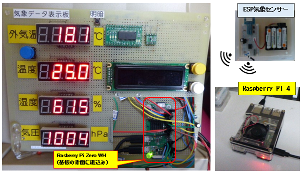
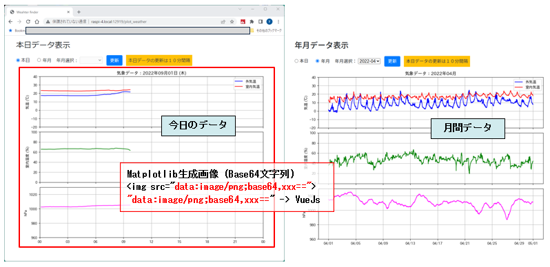
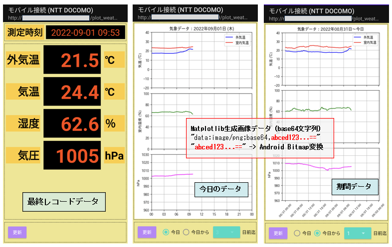
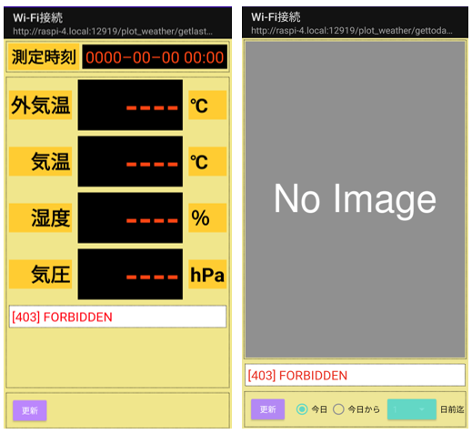

# 気象データ表示Webアプリケーション

Matplotlibで生成したグラフをブラウザまたはAndroidスマホに画像を出力するアプリについて解説します。  

* ブラウザ画面： １画面で、初期画面はFlaskアプリで当日画像を含むHTMLを生成する  
  それ以降の操作による画像データ(JSON形式)の表示はJavaScrpitで実行する
* Androidスマートホン向： ２種類のレスポンス(JSON形式)で、アプリ側で画面に対応するウィジットにデータを表示する

## 気象データについて

* ESP気象センサーが観測データ (外気温, 室内気温, 室内湿度, 気圧)を10分間隔にUDPパケットでプライベートネットワークにブロードキャスト送信しています。
* そのUDPパケットを**ラズパイ４と気象データ表示板の背面に組込みまれたラズパイzero**の双方で受信しそれぞれのデータベースに記録しています。
* 気象データ表示Webアプリケーションでは、**ラズパイ４に記録されたデータベースから**端末に応じたMatplotlibグラフ画像を生成しbase64エンコード文字列に変換したレスポンスを返却します。

<div style="text-align:center;">

</div>
<br/>

## サーバー機

* **Raspberry Pi 4 Model B (OS: Raspberry Pi OS with desktop 64-bit)**  
  PCに比べ小型で消費電力が非常に小さいので365日稼働させるサーバーとしてはピッタリ
* データベース: **Dockerコンテナ上のPostgreSQL 12**

### 1. Webアプリケーションの構成

* **Flask 2.x** + **Bootstrap 4** + **Vue.js 2 (http通信: axios)**  
* Pythonグラフ描画ライブラリ **Matplotlib 3.5**
* Pythonデータ解析ライブラリ **Pandas 1.3**
* Matplotlibで使用する日本語フォント: 最新版 **IPAexフォント**  
  > IPAフォントのダウンロードとインストール方法については下記本家サイトを参照  
  <https://moji.or.jp/ipafont/ipafontdownload/>

### 2. クライアントに提供する画面叉はレスポンス

#### 2-1. PC用ブラウザ向け画面 (1画面)

* 今日のデータ(左側)  
  (1) 初回リクエストは画面返却 (HTML)  
  (2) 2回目以降は赤枠のグラフ領域のみJavaScriptで下記レスポンス(JSON形式)を受信
* 月間データ  
   赤枠のグラフ領域のみJavaScriptで下記レスポンス(JSON形式)を受信  
   => HTML の &lt;img src="base64エンコード文字列"&gt; に設定

    ```json
    {
    "data": {
        "img_src": "data:image/png;base64,iVBORw0KGgoAAAANSUhEUgAAAR0AAADj...
    ...画像データのBase64エンコード文字列 (一部省略)...
    PxP67hSRmPQAAAABJRU5ErkJggg=="
    }, 
    "status": "success"
    }
    ```

<div style="text-align:center;">

</div>

#### 2-2. Androidスマートホン向けレスポンス

(1) 最終レコードデータ画面 (左側)   
(2) グラフ画像表示画面 (中) 今日のデータ、 (右側) 期間データ: [1, 2, 3, 7] 〜 今日  

<div style="text-align:center;">

</div>
<br/>

(1) 最終レコードデータ画面 (左側):  下記レスポンス (JSON形式)

```json
    {
        "data": {
            "humid": 63.2, 
            "measurement_time": "2022-07-29 19:26", 
            "pressure": 1012.6, 
            "temp_in": 26.1, 
            "temp_out": 24.1
        }, 
        "status": {
            "code": 0, 
            "message": "OK"
        }
    }
```

(2) データグラフ表示画面 (右側):  下記レスポンス (JSON形式)  
   画像データのBase64エンコード文字列 => Android **Bitmap変換** => Android **ImageView**

```json
    {
        "data": {
            "img_src": "data:image/png;base64,iVBORw0KGgoAAAANSUhEUgAAAR0AAADj...
        ...画像データのBase64エンコード文字列 (一部省略)...
        PxP67hSRmPQAAAABJRU5ErkJggg=="
        }, 
        "status": {
            "code": 0, 
            "message": "OK"
        }
    }
```

### 3. 不正リクエスト対応

#### 3-1. PCブラウザ

* BAD REQUEST の画像を表示して、更新ボタンを不可に設定。

<div>

</div>
<br/>

### 3-2. Androidスマートホン用レスポンス

* 画面例は**トークンチェックエラー**の場合の出力データ
* ここではレスポンスのエラーコードとメッセージをそのまま出力していますが、アプリケーションとしてはレスポンスコードに対応する日本語のメッセージをリソースに定義し出力するようにすればOKでしょう。

```json
    {
    "status": {
        "code": 403, 
        "message": "FORBIDDEN"
    }
    }
```

<div style="text-align:center;">

</div>
<br/>


### Raspberry Pi 4 へのインストール方法については下記リポジトリをご覧ください  

<https://github.com/pipito-yukio/raspi4_apps>  

[アプリソース] **src/PlotWeatherForRaspi4**
