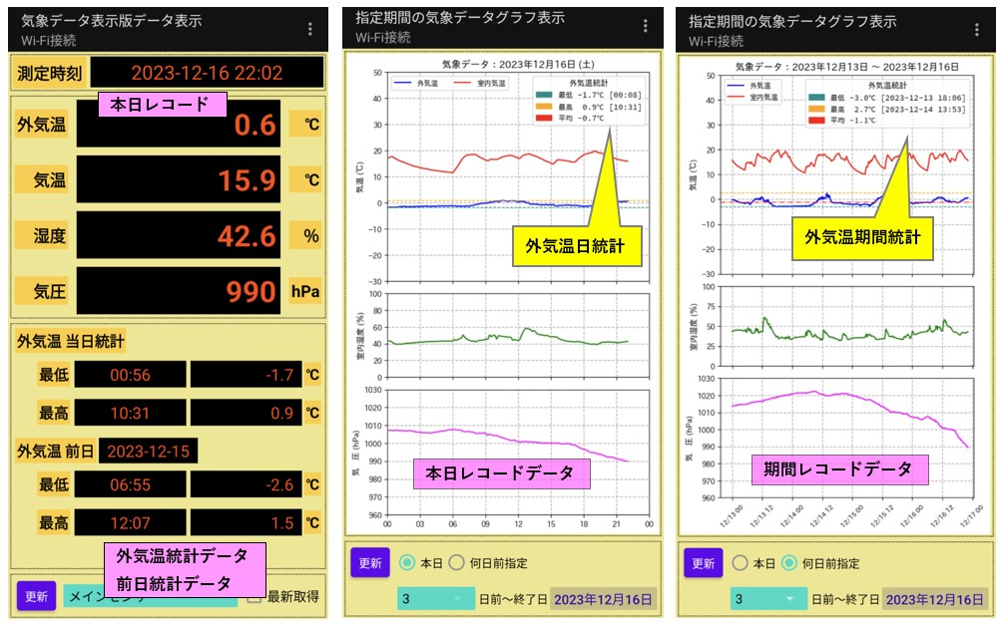

# 気象データ表示Webアプリケーション

Matplotlibで生成したグラフをブラウザまたはAndroidスマホに画像を出力するアプリ。  

* ブラウザ画面： １画面で、初期画面はFlaskアプリで当日画像を含むHTMLを生成する  
  それ以降の操作による画像データ(JSON形式)の表示はJavaScrpitで実行する
* Androidスマートホン向け： ２種類のレスポンス(JSON形式)で、アプリ側で画面に対応するウィジットにデータを表示する

## 気象データについて

* ESP気象センサーが観測データ (外気温, 室内気温, 室内湿度, 気圧)を10分間隔にUDPパケットでプライベートネットワークにブロードキャスト送信しています。
* そのUDPパケットを**ラズパイ４と気象データ表示板の背面に組込みまれたラズパイzero**の双方で受信しそれぞれのデータベースに記録しています。
* 気象データ表示Webアプリケーションでは、**ラズパイ４に記録されたデータベースから**端末に応じたMatplotlibグラフ画像を生成しbase64エンコード文字列に変換したレスポンスを返却します。

<div style="text-align:center;">

</div>
<br/>

## サーバー機

* **Raspberry Pi 4 Model B (OS: Raspberry Pi OS with desktop 64-bit)**  
  PCに比べ小型で消費電力が非常に小さいので365日稼働させるサーバーとしてはピッタリ
* データベース: **Dockerコンテナ上のPostgreSQL 12**

### 1. Webアプリケーションの構成

* **Flask 3.0** + **Bootstrap 5** + **Vue.js 3 (http通信: axios)**  
* Pythonグラフ描画ライブラリ **Matplotlib 3.5**
* Pythonデータ解析ライブラリ **Pandas 1.4**
* Matplotlibで使用する日本語フォント: 最新版 **IPAexフォント**  
  > IPAフォントのダウンロードとインストール方法については下記本家サイトを参照  
  <https://moji.or.jp/ipafont/ipafontdownload/>

### 2. クライアントに提供する画面イメージ  
レスポンスはブラウザ版、Androidアプリ版ともに画像イメージ(Base64エンコード)を含むJSON形式

#### 2-1. PC用ブラウザ向け画面 (1画面)

* 初期画面表示  
   初回リクエストはNoImage画面返却 (HTML)  
<div style="text-align:center;border:1px solid;margin:1em">

</div>
<br/>

* 年月リストと前年比較リスト取得  
センサー選択リストから観測データのセンサーを選択するとJavaScriptで年月リストと前年比較リストを受信
* 当日データ画像取得  
更新ボタンを押下すると選択されたセンサーの当日データのグラフ画像をJavaScriptで取得し画像領域を更新する
<div style="text-align:center;border:1px solid;margin:1em">

</div>

* 年月データ画像取得  
   年月データの年月リストから年月を選択し、更新ボタンを押下するとJavaScriptで選択された年月のグラフ画像を取得し画像領域を更新する
   
<div style="text-align:center;border:1px solid;margin:1em">

</div>

* 前年比較データ ★★新機能★★  
2年以上データが蓄積されてきたので、前年度データとの比較機能を追加
<div style="text-align:center;border:1px solid;margin:1em">

</div>


#### 2-2. Androidスマートホン向けレスポンス

(1) 最終レコードデータ画面 (左側)   
(2) グラフ画像表示画面 
* (中) 当日データ
* (右側) 期間データ: [1, 2, 3, 7] 〜 本日を含む過去日に遡って検索  

<div style="text-align:center;">

</div>
<br/>

(1) 最終レコードデータ画面 (左側):  下記レスポンス (JSON形式)

```json
    {
        "data": {
            "humid": 63.2, 
            "measurement_time": "2022-07-29 19:26", 
            "pressure": 1012.6, 
            "temp_in": 26.1, 
            "temp_out": 24.1,
            "rec_count": 1
        }, 
        "status": {
            "code": 0, 
            "message": "OK"
        }
    }
```

(2) データグラフ表示画面 (右側):  下記レスポンス (JSON形式)  
   画像データのBase64エンコード文字列 => Android **Bitmap変換** => Android **ImageView**

```json
    {
        "data": {
            "img_src": "data:image/png;base64,iVBORw0KGgoAAAANSUhEUgAAAR0AAADj...
        ...画像データのBase64エンコード文字列 (一部省略)...
        PxP67hSRmPQAAAABJRU5ErkJggg==",
            "rec_count": 3281
        }, 
        "status": {
            "code": 0, 
            "message": "OK"
        }
    }
```

### 3. 不正リクエスト対応

#### 3-1. PCブラウザ

* BAD REQUEST の画像を表示して、更新ボタンを不可に設定。

<div>

</div>
<br/>

### 3-2. Androidスマートホン用レスポンス

* 画面例は**トークンチェックエラー**の場合の出力データ
* ここではレスポンスのエラーコードとメッセージをそのまま出力していますが、アプリケーションとしてはレスポンスコードに対応する日本語のメッセージをリソースに定義し出力するようにすればOKでしょう。

```json
    {
    "status": {
        "code": 403, 
        "message": "FORBIDDEN"
    }
    }
```

<div style="text-align:center;">

</div>
<br/>


### Raspberry Pi 4 へのインストール方法については下記リポジトリをご覧ください  

<https://github.com/pipito-yukio/raspi4_apps>  

### Webアプリケーションソース

**src/plow_weather**

```
DAOクラス(PostgreSQL)のコード ※SQLAlchemyは使っていません
[src/plot_weather/dao]
  devicedao.py            # デバイス検索DAO
  weathercommon.py
  weatherdao.py           # 気象データ検索DAO
  weatherdao_prevcomp.py  # 前年比較気象データ検索DAO

Matplotlibのグラフ生成コード
[src/plot_weather/plotter]
  plottercommon.py
  plotterweather.py          # 気象データプロットモジュール
  plotterweather_prevcomp.py # 前年比較気象データプロットモジュール

[src/plot_weather/static/content/] # PCブラウザ向けエラー画像のbase64文字列
  BadRequest_png_base64encoded.txt
  InternalServerError_png_base64encoded.txt

[src/plot_weather/static/css] # Bootstrap 5
  bootstrap.min.css
  bootstrap.min.css.map
  bootstrap-grid.min.css
  bootstrap-reboot.min.css
  styles.min.css

[src/plot_weather/static/js]
  axios.min.js
  axios.min.js.map
  bootstrap.bundle.min.js
  bootstrap.bundle.min.js.map
  vue.global.js                # Vue.js 3
  vue.global.prod.js           #  production

[src/plot_weather/template]  # PCブラウザ向けHTML
  showplotweather.html

リクエスト処理コード      # Android端末とPCブラウザ
[src/plot_weather/viewes]
  app_main.py

[src/plot_weather/util]
  date_util.py
  file_util.py
  image_util.py

Flask アプリ初期化、PostgreSQL connection pool の設定等コード
[src/plot_weather]
  __init__.py

Waitress(本番用サーバ) & Flask(開発用内蔵サーバ) 起動切り替えコード
[src/]
  run.py

Flask 起動シェルスクリプト
[src/]
  start.sh
```
